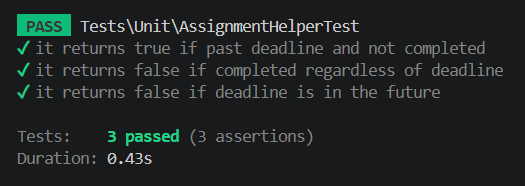
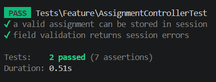
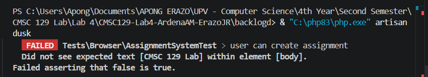
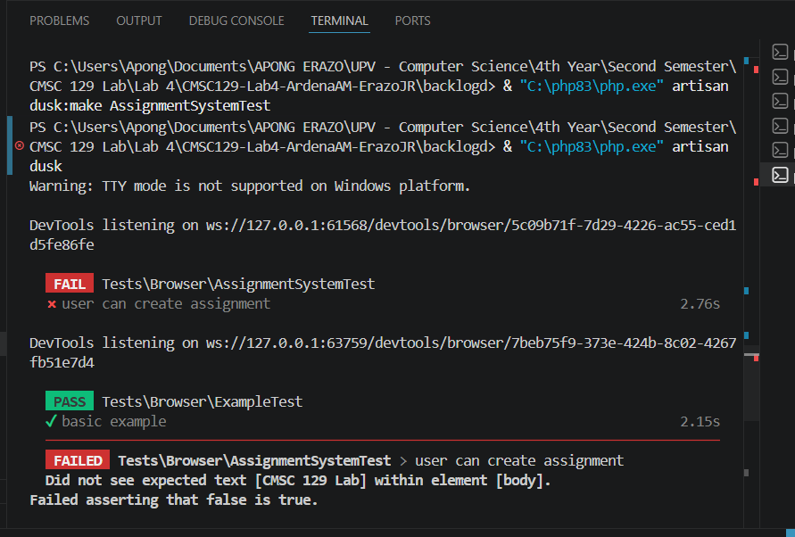
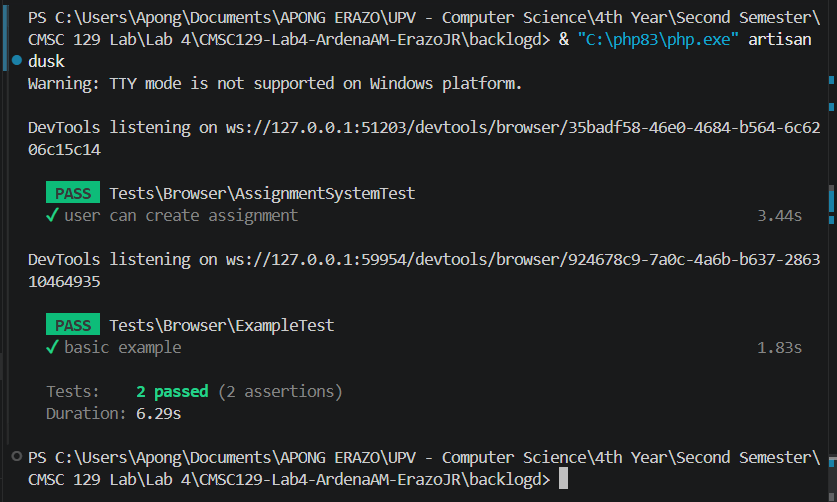

# Backlogd

## Description
Backlogd is a Laravel tracker specialized in tracking upcoming academic assignments and helping you chase deadlines. 

## User Stories

The following are user stories to be used in testing the application.

1. **Create an Assignment** - As a student, I want to create an assignment with its name, course, category, and deadline date so that I don't forget about my upcoming tasks.
2. **Set Assignment as Complete** - As a student, I want to set the assignment from "In Progress" to "Complete" to indicate to reflect on my actual progress.
3. **Filter Assignments by Category** - As a student, I want to view assignments that are still "In Progress" so that I can determine what assignments I still need to do.

## Tech Stack
	- Framework: Laravel
	- Unit Testing: PHPUnit
	- Integration Testing: PHPUnit Feature Tests
	- System Testing: Laravel Dusk

## Testing Strategy
	- Unit Testing: Test validation logic, custom model attributes (e.g., checking if an assignment is overdue), and strict status/category enum constraints.
	- Integration Testing: Test HTTP requests via controller routes (e.g., `POST /assignments` creates a record, returns a `302` or `201`, and catches invalid data validations).
	- System Testing: Use Laravel Dusk to simulate a user filling out the assignment form, clicking submit, and seeing the new task appear on the dashboard.

## Setup Instructions 
1. Clone the repository 
2. Run `composer install` 
3. Copy `.env.example` to `.env` 
4. Run `php artisan key:generate` 
5. Run `php artisan migrate`
6. Run `php artisan serve`

## CI/CD Setup

## ## CI/CD Setup

- **Tool Used:** GitHub Actions
- **Trigger:** Automated execution on every `git push` command targeting the `main` branch.

### Production Deployment Safety Guard
The pipeline enforces a strict **Test-Before-Deploy** paradigm. The workflow compilation and production deployment sequence are decoupled into separate, dependent execution blocks:
1. The `laravel-tests` job must execute and pass **all** isolated Unit (PHPUnit), Integration Feature (PHPUnit), and System Browser automation suites (Laravel Dusk).
2. The `deploy` job utilizes a conditional `needs: [laravel-tests]` requirement constraint rule. If a single assertion fails anywhere in the application testing phase, the deployment job is completely skipped, protecting the live Railway production environment from breaking changes.

---

### Screenshot of Pipeline Runs

#### 🔴 1. Red Phase Failing Pipeline (Milestone Evidence)
This run proves the Red phase of TDD. The pipeline successfully builds, but deliberately fails during the test execution block because the application logic features do not exist yet.
* **Screenshot Reference:**
  

#### 🟢 2. Green Phase Passing Pipeline (Minimum Implementation Evidence)
This run confirms the Green phase of TDD. After implementing the minimum required controller actions and view structures, the exact same test definitions now pass completely, triggering a successful live build.
* **Screenshot Reference:**
  

## Test Results

- Commit 4 — [DOCS] Unit test results

- Commit 8 - [DOCS] Integration test results 

- Commit 13 - [RED] System tests for assignment user stories

- Commit 14 - [GREEN] Implement UI for assignment system tests

- Commit 15 - [REFACTOR] Clean up assignment controller logic

